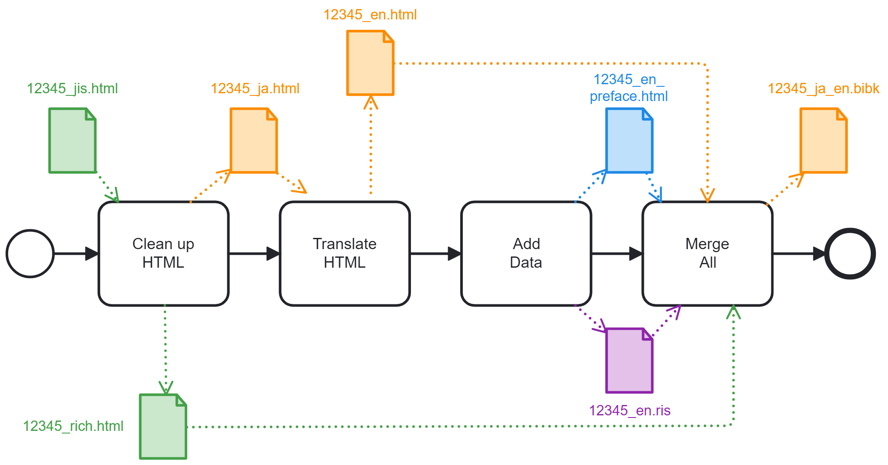
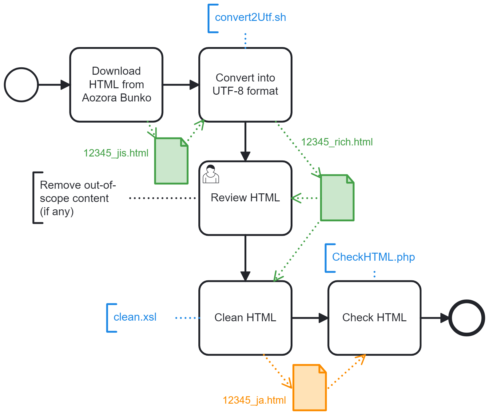

blue-sora is a preparation chain generating bilingual bibk files from Aozora Bunko HTML documents

# Initial workflow to create a new document

## File description:
- **12345-jis.html**: XHTML file available on Aozora.gr.jp. 12345 corresponds typically to the Aozora Bunko Card number, but you can use another naming convention.
- **12345-ja.html**: Cleaned up version of the above XHTML file: it contains only texts that require translation.
- **12345-furigana.xml**: Japanese reading helper extracted from the JIS file. No translation is needed.
- **12345-note.xml**: Japanese publisher notes from Aozora extracted from the JIS file. No translation is needed.
- **12345.html**: English translation of 12345-ja.html. Note: If your language is not English, don't worry: The process is the same for any language, not just English.
- **12345.xliff**: XML Localization Interchange File generated by the translation tool. It contains translator's notes.
- **12345.tmx**: Translation memory generated by the translation tool. It contains the Japanese to English segment mapping.
- **12345-preface.html**: A preface for English readers, in XHTML format.
- **12345.ris**: Bibliographic record for English readers.
- **12345.bibk**: Bilingual book in an XML format similar to DocBook V5.x.
## 1. Clean up the HTML file in Japanese

### File description:
- **12345-jis.html**: XHTML file available on Aozora.gr.jp. 12345 corresponds typically to the Aozora Bunko Card number, but you can use another naming convention.
- **12345-utf.html**: Intermediate XHTML file for review. Main characteristics compared to the Shift JIS source file:
  - UTF-8 encoding only (no graphic resource is used for rare kanji)
  - Optimized for horizontal reading
  - Automatic chapter and paragraph numbering
  - No bibliographic info
- **12345-furigana.xml**: Japanese reading helper. Translating this file does not make sense. Conform to furigana.dtd format.
- **12345-note.xml**: Japanese publisher notes from Aozora. Based on our experience, we assume that no translation is needed, as these notes usually contains comments explaining that Aozora picked up a character that is slightly different from the paper document they scanned. Conform to note.dtd format.
- **12345-ja.html**: Cleaned up version of 12345-utf.html. It contains only the text to translate. Main characteristics compared to the UTF file:
  - No metadata
  - No furigana
  - No Aozora Bunko publisher note
  - XHTML 1.0 Strict compliance
### Tool description:
- convert2Utf.sh: Bash script  
  Usage: ```convert2Utf.sh 12345-jis.html 12345-utf.html```
- furigana.xsl: XSL stylesheet V1.0
- note.xsl: XSL stylesheet V1.0
- clean.xsl: XSL stylesheet V1.0
- CheckHTML.php based on [](http://htmlpurifier.org/) to inspect the HTML body  
  Usage: ```CheckHTML.php 12345-ja.html```
## 2. Translate the document
You can have the file translated by a human or a machine.
Note: If your language is not English, don't worry: The process is the same for any language, not just English.
## 3. Add some extra information
## 4. Merge the files into a bibk file

# Iterative workflow to update an existing document
## - Update of the HTML file in Japanese
There are two distinct cases to consider depending whether the update impacts the main text or furiganas.
## - Update of the HTML file in English
## - Update of the Preface in English
## - Update of the Bibliographic Details
---
BPMN diagrams made with Camunda Modeler. [Big thanks to them!](https://camunda.com/)
