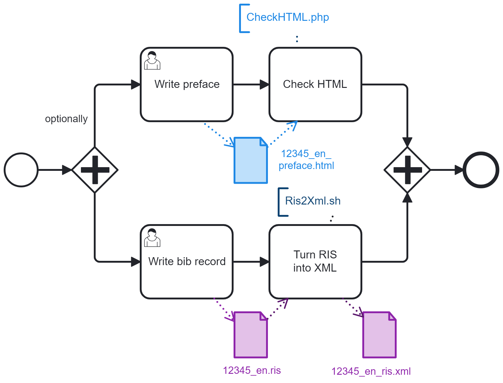
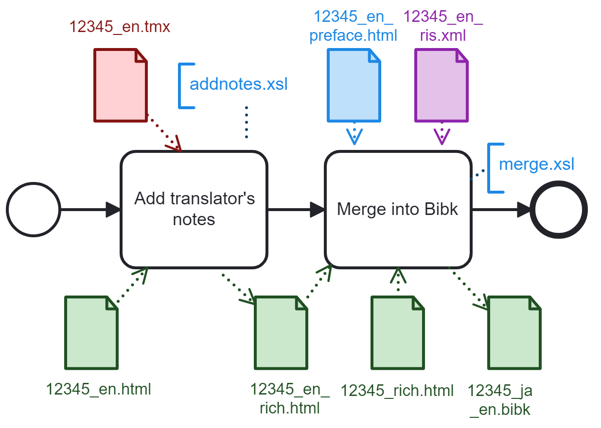

# This repository has been moved to Codeberg on June 2025. See you there!
https://codeberg.org/Japotrad/blue-sora
---

blue-sora is a preparation chain generating bilingual bibk files from Aozora Bunko HTML documents. Tools should works on all platforms, with minimal requirements: Saxon-like processor for XSLT 1.0 and 2.0, PHP 5+.

# Initial workflow to create a new document

## File description:
- **12345_jis.html**: HTML file (Shift-JIS encoding) available on Aozora.gr.jp. 12345 corresponds typically to the Aozora Bunko Card number, but you can use another naming convention.
- **12345_rich.html**: UTF-8 version of the above file.
- **12345_ja.html**: Light version of the above file (without notes and furigana). This file contains only texts that require translation.
- **12345_en.html**: English translation of the above file. Note: Don't worry if your language is not English, because the process is the same for any language.
- **12345_en.tmx**: Translation memory generated by the translation tool. It is required only if translator’s notes must be published.
- **12345.ris**: Bibliographic record for English readers.
- **12345_en_preface.html**: A preface for English readers, in HTML format.
- **12345.bibk**: Bilingual book in an XML format similar to DocBook V5.x.
## 1. Clean up the HTML file in Japanese

### File description:
- **12345_jis.html**: HTML file available on Aozora.gr.jp. 12345 corresponds typically to the Aozora Bunko Card number, but you can use another naming convention.
- **12345_rich.html**: HTML file for review. Main characteristics compared to the above file:
  - UTF-8 encoding only (no graphic resource is used for rare kanji)
  - Optimized for horizontal reading
  - Automatic chapter and paragraph numbering
  - No bibliographic info
  - Only author metadata
- **12345_ja.html**: Cleaned up version of the above file. It contains only the text to translate. Main characteristics compared to the above file:
  - No furigana
  - No Aozora Bunko publisher note
### Tool description:
- **convert2Utf.sh**: Bash script (tested with Cygwin on Windows)  
  Usage: `./convert2Utf.sh ../documents/12345_jis.html ../documents/12345_rich.html`
- **clean.xsl**: XSL stylesheet V1.0
- **CheckHTML.php** based on  to inspect the HTML body  
  Usage: `php.exe CheckHTML.php ../documents/12345_ja.html`
## 2. Translate the document
Any CAT tool could be possibly plugged into this stage, as the HTML and TMX formats are precisely standardized. In the Trados Studio flow, we can see an extra step that takes advantage of a Trados Studio comment capability that allows the translator to add a comment anywhere in the target segment (and not only on the segment as a whole, like on OmegaT). This comment will be converted into a footnote in the Bibk file during stage #4, and the footnote callout will be placed just after the words that were highlighted in Trados Studio Editor. On the OmegaT flow, footnote callouts will always be located at segment ends.

### File description:
- **12345_ja.html**: File to translate. Format: XHTML 1.1
- **12345_en.html**: English translation of the above file.  
  Note: If your language is not English, don't worry: The process is the same for any language, not just English.
- **12345_en.tmx**: Translation memory generated by translation tools. It contains the Japanese to English segment mapping and translator’s notes. Format: Translation Memory eXchange V1.4b
- **12345_en_trados.tmx**: Translation memory generated by Trados Studio. It contains the Japanese to English segment mapping but not the translator’s notes.
- **12345_en.sdlxliff**: XML Localization Interchange File generated by the Trados Studio. It contains translator's notes.
### Tool description:
- **trados_tmx.xsl**: XSL stylesheet V2.0 that injects Trados Studio segment-level comments (from 12345_en.sdlxliff) into the translation memory 12345_en_trados.tmx as footnotes, and generates 12345_en.tmx
## 3. Add some extra information

### File description:
- **12345_en_preface.html**: Preface or introduction to the main English translation 12345_en.html. Use CheckHTML.php to check the format of the file `<body>`.
- **12345_en.ris**: Single bibliographic record in [RIS format](https://en.wikipedia.org/wiki/RIS_(file_format)). Only a few tags are actually used: TI (or T1 or CT) for the (English) document title, AU (or A1) for the main author(s), A4 for the translator(s), PY for the publication year, AB for the abstract, UR for the back link to the original Aozora Bunko card.
- **12345_en_ris.xml**: Ad hoc XML-style bibliographic record.
### Tool description:
- **Ris2Xml.sh**: Bash script (tested with Cygwin on Windows)  
  Usage: `./Ris2Xml.sh ../documents/12345_en.ris ../documents/12345_en_ris.xml`
## 4. Merge the files into a bibk file

### File description:
- **12345_en.tmx**: Translation memory generated by translation tools. It contains translator’s notes.
- **12345_en.html**: English translation.
- **12345_en_rich.html**: English translation enriched with translator’s notes.
- **12345_en_preface.html**: Preface or introduction to the main English translation 12345_en.html.
- **12345_en_ris.xml**: XML-style bibliographic record, limited to a few tags: TI (or T1 or CT), AU (or A1), A4 for the translator(s), PY, AB and UR.
- **12345_rich.html**: HTML document (in Japanese).
- **12345_ja_en.bibk**: Bilingual book in [Bibk format](https://github.com/japotrad/bibk)
### Tool description:
- **addnotes.xsl**: XSL stylesheet V2.0 adding translator’s notes to the main translation file (12345_en.html).
  Input parameter:
  - *tmx*: Path to the translation memory (by default: generated from the main translation file name, by replacing .html with .tmx)
- **merge.xsl**: XSL stylesheet V2.0 processing the segmented HTML file (12345_en_seg.html)  
  Input parameters:  
  - *lang*: Language of 12345_en.html (by default: substring between underscore and dot from the main translation file)  
  - *ris*: Path to the XML-formatted RIS file (by default: generated from the main translation file name, by replacing .html with _ris.xml 
  - *preface*: Path to the optional preface file in English (by default: generated from the main translation file name, by replacing .html with _preface.html)
  - *ja*: Path to the Japanese HTML document (by default: generated from the main translation file name, by replacing _en.html with _rich.html)  
  - *tmx*: Path to the optional translation memory (by default: generated from the main translation file name, by replacing .html with .tmx)

# Iterative workflow to update an existing document
## - Update of the HTML file in Japanese
There are two distinct cases to consider depending whether the update impacts the main text or furiganas.
## - Update of the HTML file in English
## - Update of the Preface in English
## - Update of the Bibliographic Details
---
BPMN diagrams made with Camunda Modeler. [Big thanks to them!](https://camunda.com/)
