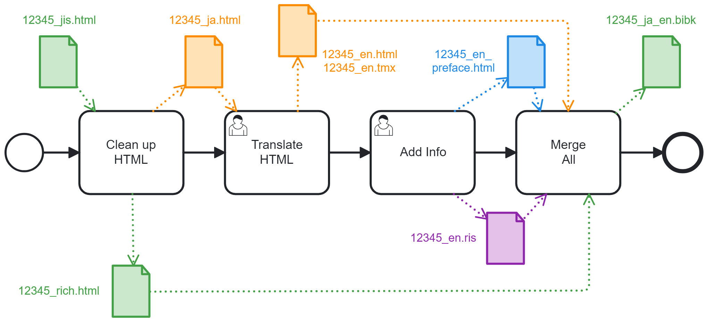
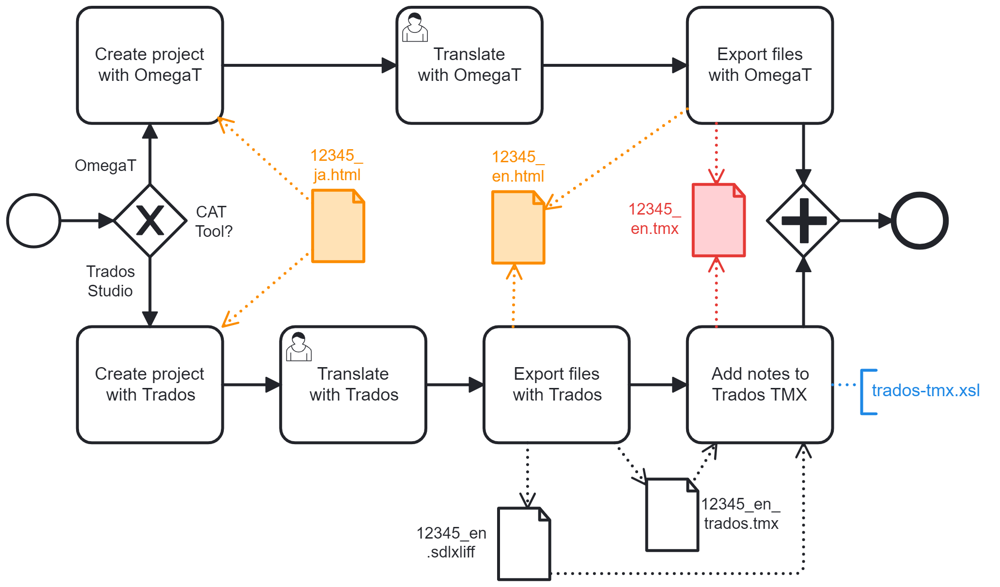

blue-sora is a preparation chain generating bilingual bibk files from Aozora Bunko HTML documents. Tools should works on all platforms, with minimal requirements: Saxon-like processor for XSLT 1.0 and 2.0, PHP 5+.

# Initial workflow to create a new document

## File description:
- **12345-jis.html**: XHTML file available on Aozora.gr.jp. 12345 corresponds typically to the Aozora Bunko Card number, but you can use another naming convention.
- **12345-ja.html**: Cleaned up version of the above XHTML file: it contains only texts that require translation.
- **12345-furigana.xml**: Japanese reading helper extracted from the JIS file. No translation is needed.
- **12345-note.xml**: Japanese publisher notes from Aozora extracted from the JIS file. No translation is needed.
- **12345-en.html**: English translation of 12345-ja.html. Note: If your language is not English, don't worry: The process is the same for any language, not just English.
- **12345-en.tmx**: Translation memory generated by the translation tool. It contains the Japanese to English segment mapping and translator’s notes.
- **12345-en-preface.html**: A preface for English readers, in XHTML format.
- **12345.ris**: Bibliographic record for English readers.
- **12345.bibk**: Bilingual book in an XML format similar to DocBook V5.x.
## 1. Clean up the HTML file in Japanese

### File description:
- **12345-jis.html**: XHTML file available on Aozora.gr.jp. 12345 corresponds typically to the Aozora Bunko Card number, but you can use another naming convention.
- **12345-utf.html**: Intermediate XHTML file for review. Main characteristics compared to the Shift JIS source file:
  - UTF-8 encoding only (no graphic resource is used for rare kanji)
  - Optimized for horizontal reading
  - Automatic chapter and paragraph numbering
  - No bibliographic info
- **12345-furigana.xml**: Japanese reading helper. Translating this file does not make sense. Conform to furigana.dtd format.
- **12345-note.xml**: Japanese publisher notes from Aozora. Based on our experience, we assume that no translation is needed, as these notes usually contains comments explaining that Aozora picked up a character that is slightly different from the paper document they scanned. Conform to note.dtd format.
- **12345-ja.html**: Cleaned up version of 12345-utf.html. It contains only the text to translate. Main characteristics compared to the UTF file:
  - No metadata
  - No furigana
  - No Aozora Bunko publisher note
  - XHTML 1.0 Strict compliance
### Tool description:
- convert2Utf.sh: Bash script (tested with Cygwin on Windows)  
  Usage: `./convert2Utf.sh ../documents/12345-jis.html ../documents/12345-utf.html`
- furigana.xsl: XSL stylesheet V1.0
- note.xsl: XSL stylesheet V1.0
- clean.xsl: XSL stylesheet V1.0
- CheckHTML.php based on  to inspect the HTML body  
  Usage: `php.exe CheckHTML.php ../documents/12345-ja.html`
## 2. Translate the document

### File description:
- **12345-ja.html**: File to translate. Format: XHTML 1.0 Strict
- **12345-en.html**: English translation of the above file.  
  Note: If your language is not English, don't worry: The process is the same for any language, not just English.
- **12345-en.tmx**: Translation memory generated by translation tools. It contains the Japanese to English segment mapping and translator’s notes.
- **12345-en-beta.tmx**: Translation memory generated by Trados Studio. It contains the Japanese to English segment mapping but not the translator’s notes.
- **12345-en.sdlxliff**: XML Localization Interchange File generated by the Trados Studio. It contains translator's notes.

## 3. Add some extra information

### File description:
- **12345-en.ris**: Single bibliographic record in [RIS format](https://en.wikipedia.org/wiki/RIS_(file_format)). Only a few tags are actually used: TI for the (English) document title, AU for the main author(s), A4 for the translator(s), PY for the publication year, AB for the abstract, UR for a back link to the original Aozora Bunko card.
- **12345-en-preface.html**: Preface or introduction to the main English translation 12345-en.html. Format: XHTML 1.0 Strict. Use CheckHTML.php to check the file `<body>` format.
## 4. Merge the files into a bibk file

# Iterative workflow to update an existing document
## - Update of the HTML file in Japanese
There are two distinct cases to consider depending whether the update impacts the main text or furiganas.
## - Update of the HTML file in English
## - Update of the Preface in English
## - Update of the Bibliographic Details
---
BPMN diagrams made with Camunda Modeler. [Big thanks to them!](https://camunda.com/)
